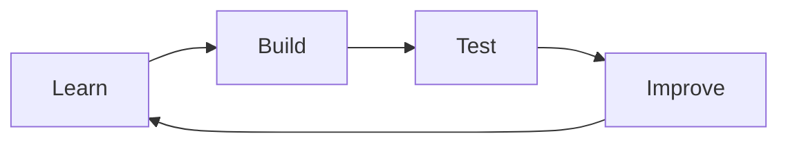

<div align="center">

# Hi, I'm IzNescafe

### Aspiring Game Developer | Curious Builder | Lifelong Learner

[](https://github.com/IzNescafe)
[](https://github.com/IzNescafe?tab=followers)

</div>

## About Me

```text
Name       IzNescafe
Pronouns   she/her
Focus      Game Development
Mindset    Explore, learn, build, and improve
```

- Currently learning and experimenting with **game development**
- Interested in exploring new technologies and creative ideas
- Looking to learn from and collaborate with experienced developers
- Always open to interesting projects and new challenges

## Current Focus



## GitHub Activity

<div align="center">


</div>

## Connect

[](https://discord.com/)
[](https://github.com/IzNescafe)

---

<div align="center">
  <sub>Learning one project at a time.</sub>
</div>
